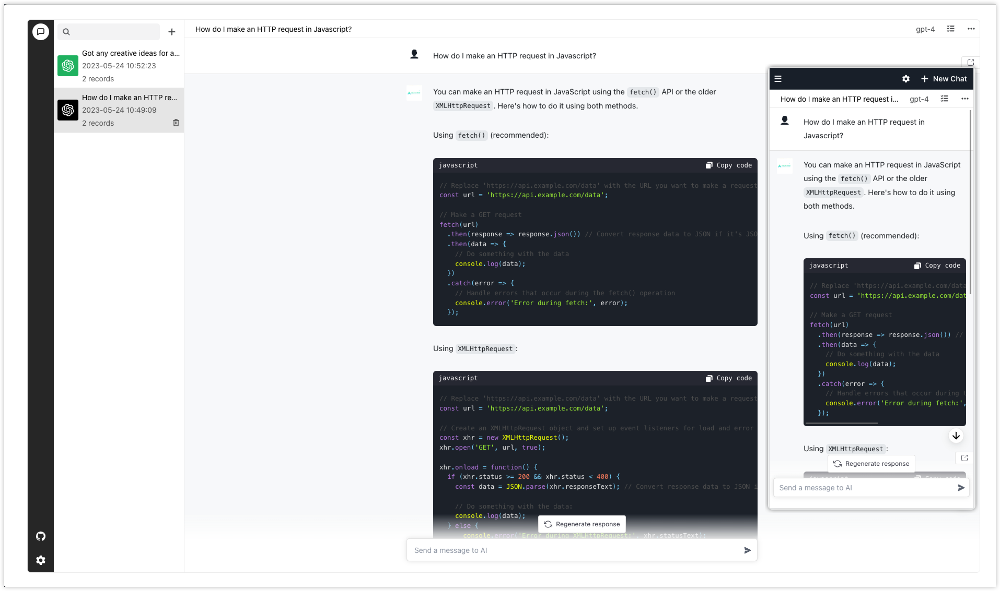

<div align="center">
  <a href="https://github.com/AIOS-club/lite.aios.chat">
    
  </a>

  <h3 align="center">aios chat</h3>

  <p align="center">
    <a href="https://github.com/AIOS-club/aios.chat/">简体中文</a>
    ·
    <a href="https://github.com/AIOS-club/aios.chat/blob/main/README.en.md">English</a>
  </p>

  <p align="center">
    <a href="https://www.aios.chat">Demo</a>
    ·
    <a href="https://github.com/AIOS-club/aios.chat/issues">Issues</a>
    ·
    <a href="https://github.com/AIOS-club/aios.chat/issues">Feature Requests</a>
  </p>
</div>

<br />

- [Preview](#preview)
- [Introduction](#introduction)
- [Getting Started](#getting-started)
- [Environment Variables](#environment-variables)
- [Deployment](#deployment)
- [Features](#features)
- [Upcoming Features](#upcoming-features)
- [FAQ](#faq)
- [License](#license)

## Preview


<br />

## Introduction
This project comes with a built-in server for local development and testing, and can also be directly deployed online for personal learning use.
Want to use your own API? No problem, the client can connect to the server of this project as well as any official standard API.

We recommend connecting to [AIOK](https://key.aios.chat), which is free for the first registration and provides 100,000 points for free.
## Getting Started
Node.js v18.x.0 is recommended.

If you have ```nvm``` installed locally, you can use ```nvm use``` to switch to the recommended version of Node.js.

```bash
npm run inst # Installation

npm run dev # Running

npm run dev:env # Generating environment variable files during runtime
```

> After using the ```npm run dev:env``` command, if you need a local server, you need to fill in the correct and available API KEY in the .env.development file generated under the /api directory.

> If you use a local server, Chinese users may need to proxy the interface themselves.

**Using the official interface directly**

Modify your local ```VITE_API_HOST```, and enter your own API KEY in the settings (shown below) and click Save. 
```bash
VITE_API_HOST="https://api.openai.com/v1/chat/completions"
```


## Environment Variables
Please refer to the **.env.example** file.<br />
```bash
# Prompt for the input box
VITE_DEFAULT_PLACEHOLDER='send message to AI'

# Bottom message of the input box
VITE_DEFAULT_BOTTOM_TIPS=''

# API_HOST
VITE_API_HOST='http://localhost:3000/aios-chat'

# Whether to return only text content, which means whether the stream needs to be parsed by the frontend.
VITE_ONLY_TEXT=true

# The maximum number of dialogues to be cached excluding system information
VITE_CACHE_TIMES=10

# BASE_URL
VITE_BASE_URL='/' # BASE_URL

# AI avatar url
VITE_AI_AVATOR_URL=''

# User avatar url
VITE_USER_AVATOR_URL=''

# Home page logo url
VITE_LOGO_URL=''

# Display information below the homepage logo
VITE_INFO=''
```

## Deployment
To be updated later.

## Features
- Contextual conversation
- Chat history
- Markdown rendering
- Katex mathematical formula support
- Share current conversation with one click
- Streaming transmission
- Dark mode

## Upcoming Features
- [x] github action（eslint）
- [x] custom API key
- [ ] Pre-set scenario-based robot system applications
- [ ] prompt store
- [ ] Adding a BFF layer to the backend
- [ ] Adding http and socks proxy configuration or providing some pre-installed openai interface proxies
- [ ] Access control
- [x] Material modification of openai model (3.5, 3.0) and modification of interface parameters temperature, frequency_penalty, presence_penalty
- [ ] Multi-language support
- [ ] One-click deployment document
- [ ] GitHub pages automatic deployment
- [ ] docker-compose files

## FAQ

Q: Why is it that after using the official interface, a large character string is returned without being parsed?

A: Because the ```VITE_ONLY_TEXT``` in the environment variables is set to true by default, there is no parsing on the client side. Change it to false or delete it.

## License

MIT License © [AIOS-club](./LICENSE)