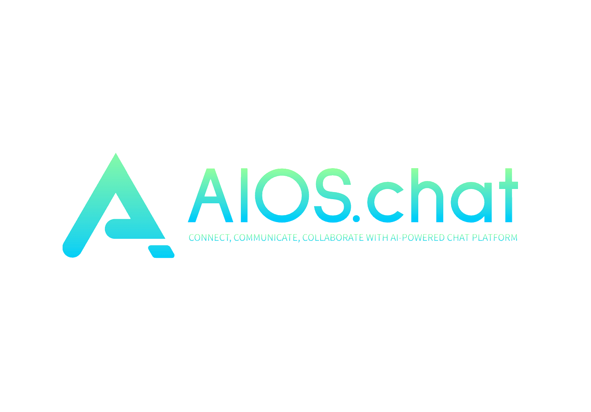
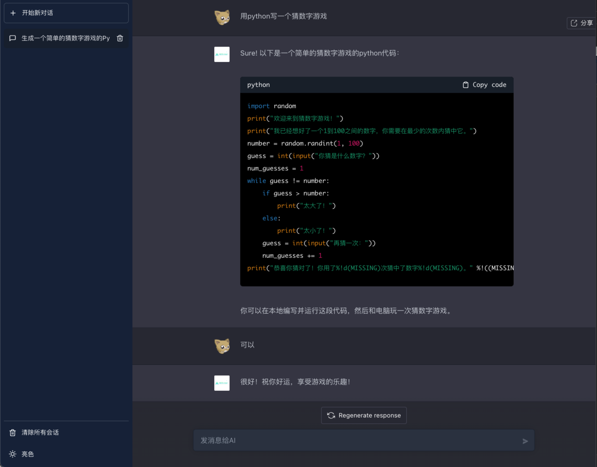

<div align="center">
  <a href="https://github.com/AIOS-club/lite.aios.chat">
    
  </a>

  <h3 align="center">lite aios chat</h3>

  <p align="center">
    和ai对话的lite版网页端
    <br />
    <br />
    <a href="">View Demo</a>
    ·
    <a href="https://github.com/AIOS-club/lite.aios.chat/issues">Report Bug</a>
    ·
    <a href="https://github.com/AIOS-club/lite.aios.chat/issues">Request Feature</a>
  </p>
</div>

## Preview
<br />

<br />
<br />

## Built With

本项目由以下技术栈构建

  [![React][React-logo]][React-url]


## Get Started
```bash
npm install

npm run dev
```
> 可能会遇到的版本不兼容问题，请尝试使用以下命令
```bash
npm install --legacy-peer-deps
```

## 环境变量
请参考 **.env.production** 文件。<br />
```bash
VITE_API_HOST='' # api host
VITE_CACHE_TIMES=10 # 最大缓存的对话数，你应该限制用户的上下文缓存的对话数量
VITE_BASE_URL='/' # BASE_URL
VITE_DEFAULT_PLACEHOLDER='' # 输入框的placeholder
VITE_DEFAULT_BOTTOM_TIPS='' # 底部的消息
VITE_AI_AVATOR_URL='' # ai avator
VITE_USER_USER_URL='' # user avator
```
首次```npm run dev```，对话会失败，是因为本地需要 **.env.development** 文件,请先创建一个 **.env.development** 文件，并将 **.env.production** 文件里的内容复制进去
> 后续在 ```npm run dev``` 的命令时会执行脚本，自动创建该文件


## 已支持的功能
- 上下文对话 最大3000tokens 可配置
- 历史会话
- markdown渲染
- katex数学公式支持
- 支持图片问答（后续接口支持）
- 可一键分享当前会话
- 暗夜模式

## TODO
- 预设场景化机器人system应用
- 流式传输
- prompt store
- 添加后端BFF层
- 添加http和socks代理配置或提供一些预置的openai接口代理
- 访问权限控制
- 可修改openai的模型（3.5、3.0）可修改接口参数temperature、model、temperature、frequency_penalty、presence_penalty
- 多语言支持
- 一键部署文档
- github action（打包验证，代码规范eslint等）
- GitHub pages自动部署
- docker-compose编写
- 使用自定义API Key


[React-logo]: https://img.shields.io/badge/React-20232A?style=for-the-badge&logo=react&logoColor=61DAFB
[React-url]: https://reactjs.org/