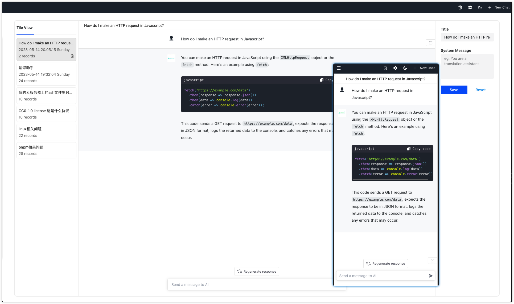
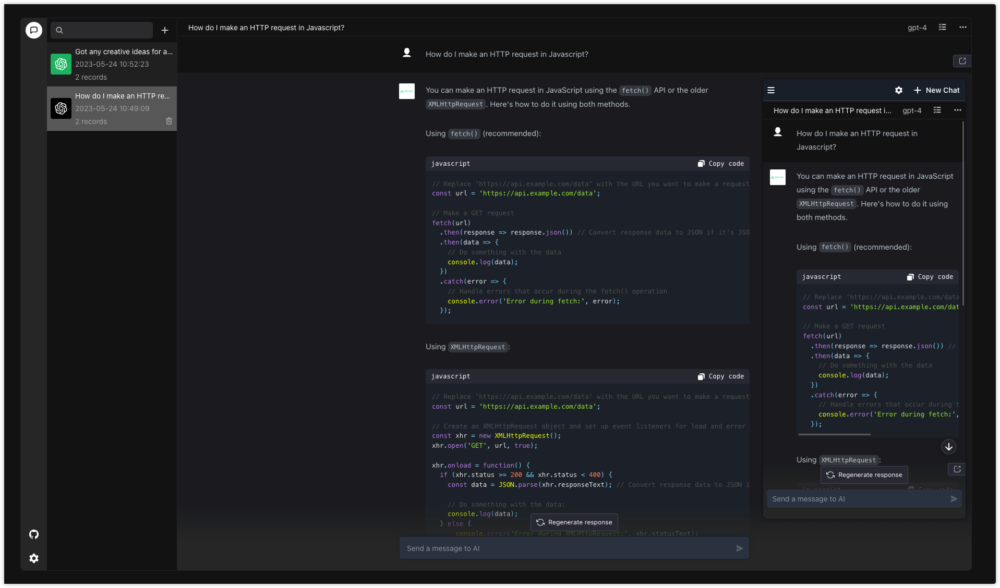
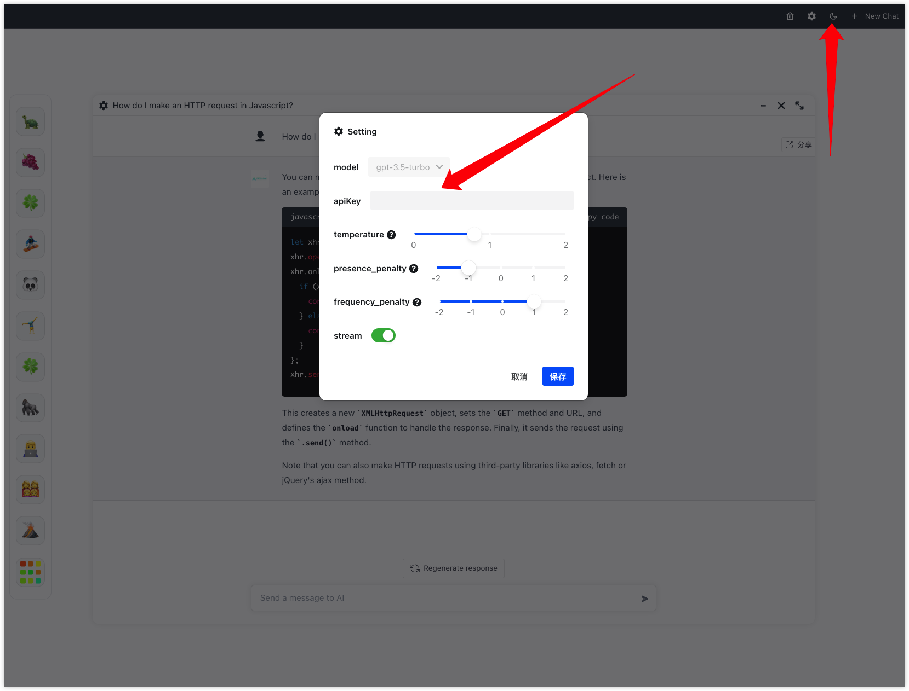

<div align="center">
  <a href="https://github.com/AIOS-club/lite.aios.chat">
    
  </a>

  <h3 align="center">aios chat 💬</h3>

  <p align="center">
    <a href="https://www.aios.chat">View Demo</a>
    ·
    <a href="https://github.com/AIOS-club/lite.aios.chat/issues">Report Bug</a>
    ·
    <a href="https://github.com/AIOS-club/lite.aios.chat/issues">Request Feature</a>
  </p>
</div>

<br />

- [Preview](#preview)
- [Introduction](#introduction)
- [Get Started](#get-started)
- [Environment variables](#environment-variables)
- [Deploy](#deploy)
- [Supported features](#supported-features)
- [Roadmap](#roadmap)
- [FAQ](#faq)
- [License](#license)

## Preview


<br />

## Introduction
本项目自带服务端用于本地开发和调试，也可直接部署至线上用于个人学习使用。
想使用自己的API？也可以，客户端可接入本项目的服务端以及任何符合官方标准的api。

推荐接入[AIOK](https://key.aios.chat)，国内免代理，首次注册免费赠送 100,000 points.
## Get Started
推荐采用```node 18.x.0```

如果你本地安装了```nvm```, 可直接使用```nvm use```


```bash
npm run inst # install

npm run dev # run

npm run dev:env # generate environment variable files during runtime
```

> 使用```npm run dev:env```命令后，如果需要本地服务端，则需要在/api文件下生成的.env.development文件中填入正确可用的API KEY

> 使用本地服务端，国内用户可能需要自行代理接口

**直接使用官方接口**

修改本地的```VITE_API_HOST```, 并且在设置（下方图中）里填入自己的API KEY后点击保存即可
```bash
VITE_API_HOST="https://api.openai.com/v1/chat/completions"
```



## Environment variables
请参考 **.env.example** 文件。<br />
```bash
# 输入框的提示词
VITE_DEFAULT_PLACEHOLDER='发消息给AI'

# 输入框底部的消息
VITE_DEFAULT_BOTTOM_TIPS=''

# API_HOST
VITE_API_HOST='http://localhost:3000/aios-chat'

# 是否只返回文字内容，它意味着stream流是否需要前端解析。
VITE_ONLY_TEXT=true

# 最多缓存的对话次数 不包括system信息
VITE_CACHE_TIMES=10

# BASE_URL
VITE_BASE_URL='/' # BASE_URL

# ai avator
VITE_AI_AVATOR_URL=''

# user avator
VITE_USER_AVATOR_URL=''

# logo url
VITE_LOGO_URL=''

# info
VITE_INFO=''
```

## Deploy
Waiting for update.

## Supported features
- 上下文对话
- 历史会话
- markdown渲染
- katex数学公式支持
- 可一键分享当前会话
- 流式传输
- 暗夜模式

## Roadmap
- [x] github action（eslint）
- [x] custom API key
- [ ] 预设场景化机器人system应用
- [ ] prompt store
- [ ] 添加后端BFF层
- [ ] 添加http和socks代理配置或提供一些预置的openai接口代理
- [ ] 访问权限控制
- [x] 可修改openai的模型（3.5、3.0）可修改接口参数temperature、frequency_penalty、presence_penalty
- [ ] 多语言支持
- [ ] 一键部署文档
- [ ] GitHub pages自动部署
- [ ] docker-compose编写

## FAQ

Q:为什么使用官方接口后，返回的是一大串字符，没有解析？

A:因为环境变量里的```VITE_ONLY_TEXT```默认为true，没有在客户端解析，将它改为false或者删除即可
## License

MIT License © [AIOS-club](./LICENSE)