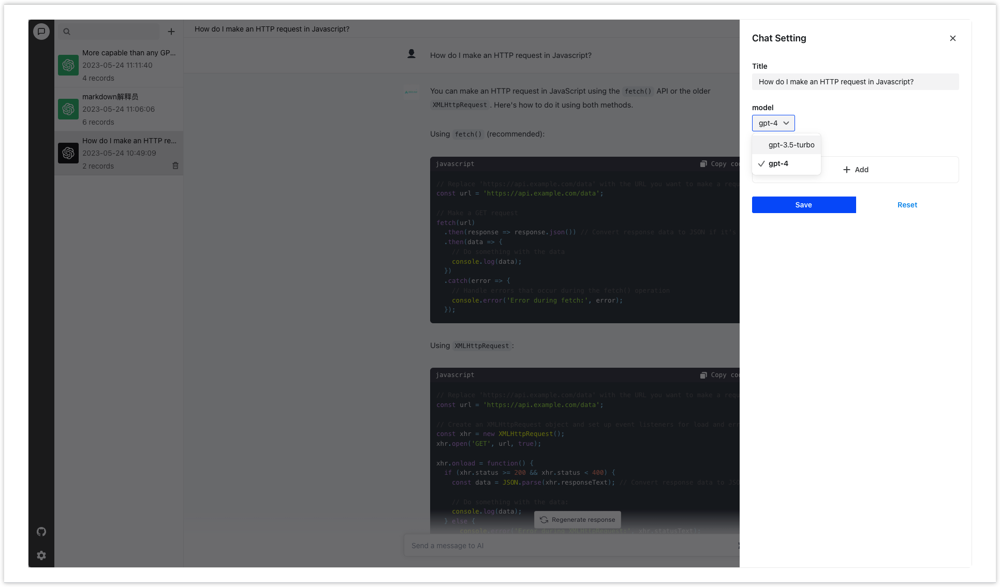
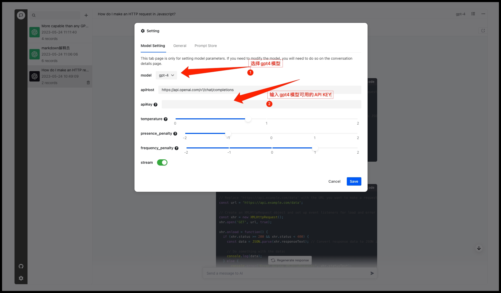

<div align="center">
  <a href="https://github.com/AIOS-club/lite.aios.chat">
    
  </a>

  <h3 align="center">aios chat</h3>

  <p align="center">
    <a href="https://github.com/AIOS-club/aios.chat/">简体中文</a>
    ·
    <a href="https://github.com/AIOS-club/aios.chat/blob/main/README.en.md">English</a>
  </p>

  <p align="center">
    <a href="https://www.aios.chat">示例</a>
    ·
    <a href="https://github.com/AIOS-club/lite.aios.chat/issues">问题反馈</a>
    ·
    <a href="https://github.com/AIOS-club/lite.aios.chat/issues">需求建议</a>
  </p>
</div>

<br />

- [预览](#预览)
- [简介](#简介)
- [开始使用](#开始使用)
- [环境变量](#环境变量)
- [部署](#部署)
- [已支持的功能](#已支持的功能)
- [后续要做的功能](#后续要做的功能)
- [常见问题](#常见问题)
- [License](#license)

## 预览


<br />

## 简介
本项目自带服务端用于本地开发和调试，也可直接部署至线上用于个人学习使用。
想使用自己的API？也可以，客户端可接入本项目的服务端以及任何符合官方标准的api。

推荐接入[AIOK](https://key.aios.chat)，国内免代理，首次注册免费赠送 100,000 points.

**目前支持以下几个模型**
| 模型 | 描述 | 最大上下文 | 训练数据截止时间| 优点 | 缺点 |
| ---- | ---- | ---- | ---- | ---- | ---- |
| gpt-3.5-turbo  | 最具有能力的GPT-3.5模型之一，以1/10的价格进行了针对聊天的优化，远低于text-davinci-003| 4096tokens   | 截至 2021 年 9 月 | 响应速度更快，tokens消耗速率更慢 | 智能程度比起gpt4稍逊一筹 |
| gpt4 | 比任何GPT-3.5模型更具有能力，能够执行更复杂的任务，并且针对聊天进行了优化   | 8,192tokens   | 截至 2021 年 9 月 | 更加智能，更精确的解决问题 | 响应速度较慢, tokens消耗速率对比3.5要多一些 |

你可以在每个对话的设置页面进行模型选择，或者在新建对话的时候选择你要想对话的模型



对于gpt4模型，需要注意的是，需要在配置页面选择gpt4，然后输入gpt4模型可用的API KEY



## 开始使用
推荐采用```node 18.x.0```

如果你本地安装了```nvm```, 可直接使用```nvm use```


```bash
npm run inst # 安装

npm run dev # 运行

npm run dev:env # 运行时生成环境变量文件

npm run dev:vite # 只运行前端，如果你不想使用本地api
```

> 使用```npm run dev:env```命令后，如果需要本地服务端，则需要在/api文件下生成的.env.development文件中填入正确可用的API KEY

> 使用本地服务端，国内用户可能需要自行代理接口

**直接使用官方接口**

修改本地的```VITE_API_HOST```, 并且在设置（下方图中）里填入自己的API KEY后点击保存即可
```bash
VITE_API_HOST="https://api.openai.com/v1/chat/completions"
```


**不想设置环境变量？**

没问题，只需要在上图的设置中直接填入官方的接口
```https://api.openai.com/v1/chat/completions```
然后输入正确可用的API KEY即可

## 环境变量
请参考 **.env.example** 文件。<br />
```bash
# 输入框的提示词
VITE_DEFAULT_PLACEHOLDER='发消息给AI'

# 输入框底部的消息
VITE_DEFAULT_BOTTOM_TIPS=''

# API_HOST
VITE_API_HOST='http://localhost:3000/aios-chat'

# GPT4 API_HOST
VITE_API_HOST_GPT4='https://api.openai.com/v1/chat/completions'

# 是否只返回文字内容，它意味着stream流是否需要前端解析。
VITE_ONLY_TEXT=true

# 最多缓存的对话次数 不包括system信息
VITE_CACHE_TIMES=10

# BASE_URL
VITE_BASE_URL='/' # BASE_URL

# AI 头像url
VITE_AI_AVATOR_URL=''

# 用户头像url
VITE_USER_AVATOR_URL=''

# 首页logo url
VITE_LOGO_URL=''

# 首页logo下方的显示信息
VITE_INFO=''
```

## 部署
后续更新

## 已支持的功能
- 上下文对话
- 历史会话
- markdown渲染
- katex数学公式支持
- 可一键分享当前会话
- 流式传输
- 暗夜模式
- 支持gpt4

## 后续要做的功能
- [x] github action（eslint）
- [x] custom API key
- [x] 预设场景化机器人system应用
- [x] prompt store
- [ ] 添加后端BFF层
- [ ] 添加http和socks代理配置或提供一些预置的openai接口代理
- [ ] 访问权限控制
- [x] 可修改openai的模型（3.5、3.0）可修改接口参数temperature、frequency_penalty、presence_penalty
- [ ] 多语言支持
- [ ] 一键部署文档
- [ ] docker-compose编写

## 常见问题

Q:为什么使用官方接口后，返回的是一大串字符，没有解析？

A:~~因为环境变量里的```VITE_ONLY_TEXT```默认为true，没有在客户端解析，将它改为false或者删除即可~~
> 现在默认为false了
## License

MIT License © [AIOS-club](./LICENSE)